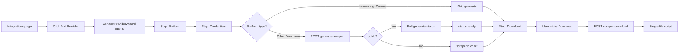

# User Path to Creating the Scraper Script

This document traces the paths a user can take from the dashboard to the final downloadable scraper script (`.command` on Mac or `.bat` on Windows).

---

## Entry Points

The user can reach the scraper flow from three places:

| Entry | Location | Component | Outcome |
|-------|----------|-----------|---------|
| **1. Integrations page (bundle)** | Dashboard → Integrations → "Connect Your School" card | `SelfHostedScraperCard` | Add one or more platforms to a bundle, then **Download Bundle** (one script for N platforms). |
| **2. Integrations page (single)** | Dashboard → Integrations → "Add Provider" button | `ConnectProviderWizard` (no `onConnectionReady`) | Single platform: generate or pick reference → **Download** one script. |
| **3. Add Student wizard** | Dashboard → Students → Add Student → Connect Services | `AddStudentWizard` with embedded `ConnectProviderWizard` | Add platforms to a bundle in-context, then **Download Bundle** from the wizard. |

Navigation: **Sidebar → Integrations** (`/dashboard/integrations`) or **Add Student** flow.

---

## Path 1: Single-Platform Script (Integrations → Add Provider)

**Steps in code:**

1. **Platform** – User enters school portal URL and/or selects a provider (Canvas, Aeries, Skyward, … or "Other Platform").
2. **Credentials** – User enters username, password, and optional student name hint. Clicks Next.
3. **Generate (only for non-reference)**  
   - **Known platform** (Canvas, Aeries, Skyward): no API call; wizard goes straight to **Download**.  
   - **Other / unknown**:  
     - `POST /api/integrations/generate-scraper` with `platformName`, `loginUrl`, `loginMethod`, `dataTypes`.  
     - API returns either:
       - `jobId` → frontend polls `GET /api/integrations/generate-status?jobId=...` until `status === 'ready'`, then has `scraperId` / code; or  
       - immediate `scraperId` + `code` (e.g. from cache); or  
       - for known platform, immediate reference code (no job).  
4. **Download** – User clicks Download.  
   - `POST /api/integrations/scraper-download` with body:  
     `{ os, scraperId?, platform?, url?, credentials: { studentName, username, password, studentNameHint? } }`.  
   - API uses **single-platform flow**: resolves scraper by `scraperId` (from `generated_scrapers`) or by `platformName` (reference stub), then `packageSingleFile(...)`.  
   - Response: one script file (Mac `.command` or Windows `.bat`) containing embedded scraper, transformer, metadata, and a run.js that runs the full BaseScraper lifecycle (initialize → authenticate → scrape → transform → upload).

**Backend (single-platform):**  
[integrations.ts](packages/api/src/routes/integrations/integrations.ts) ~1387–1432: `scraperId` or `platformName` → `scraperCode` → `packageSingleFile(...)`.

---

## Path 2: Bundle Script (Integrations → Connect Your School)

```mermaid
flowchart LR
  A[Integrations page] --> B[Connect Your School card]
  B --> C[Get Started or Add another platform]
  C --> D[ConnectProviderWizard with onConnectionReady]
  D --> E[Platform then Credentials]
  E --> F{Reference platform?}
  F -->|Yes| G[Add to bundle no job]
  F -->|No| H[POST generate-scraper]
  H --> I[Poll or immediate]
  I --> J[Add to bundle with scraperId]
  G --> K[Wizard closes connection in list]
  J --> K
  K --> L[User may add more platforms]
  L --> M[Download Bundle]
  M --> N[POST scraper-download with connections]
  N --> O[Bundle script]
```

**Steps in code:**

1. User clicks **Get Started** or **Add another platform** on the "Connect Your School" card.  
   `SelfHostedScraperCard` opens `ConnectProviderWizard` with **`onConnectionReady`** (no `onAdded` for the initial add).
2. Same wizard steps: **Platform** → **Credentials** → for "Other", **generate-scraper** + optional poll until ready.
3. When done (reference or job ready), wizard calls `onConnectionReady(connection)`.  
   Connection has: `platformId`, `platformName`, `loginUrl`, `username`, `password`, `studentNameHint?`, `scraperId` (or null for reference), `generationStatus: 'ready'`.
4. Card appends the connection to local state `bundle` and closes the wizard. User can add more platforms the same way.
5. User clicks **Download Bundle**.  
   - `POST /api/integrations/scraper-download` with body:  
     `{ os, connections: [ { platformId, platformName, loginUrl, scraperId, credentials: { username, password, studentNameHint? } }, ... ] }`.  
   - API uses **bundle flow**: for each connection, `resolveScraperCode(collection, { scraperId, platformName, loginUrl })` (DB or reference stub or generic fallback), then `packageBundle({ connections: resolvedConnections, ... })`.  
   - Response: one script that embeds per-connection `scraper-{platformId}.ts`, `transformer-{platformId}.ts`, `metadata-{platformId}.json`, shared `payload.json`, `package.json`, `tsconfig.json`, and a `run.js` that uses `generateBundleRunJs` (ts-node, full BaseScraper lifecycle per connection, discoverStudents/switchToStudent, ingest API).

**Backend (bundle):**  
[integrations.ts](packages/api/src/routes/integrations/integrations.ts) ~1222–1274: `body.connections` → resolve scraper code per connection → `packageBundle(...)`.

---

## Path 3: Add Student Wizard (Bundle from student flow)

Same bundle flow as Path 2, but started from **Add Student**:

1. User opens Add Student wizard, reaches **Connect Services** (or similar) step.
2. Clicks to add a new provider → same `ConnectProviderWizard` with **`onConnectionReady`**.
3. Each completed connection is pushed to the wizard’s local `bundle` state.
4. User clicks **Download Bundle** in the wizard.  
   Same `POST /api/integrations/scraper-download` with `{ os, connections }` and same backend bundle flow as Path 2.

**Code:** [AddStudentWizard.tsx](packages/web/components/dashboard/AddStudentWizard.tsx) (bundle state, `ConnectProviderWizard` with `onConnectionReady`, and the same fetch to `scraper-download` with `connections`).

---

## Alternate: “Download Script (all students)”

On the **Connect Your School** card there is a second button: **Download Script (all students)**.

- **Request:** `POST /api/integrations/scraper-download` with `{ os, useAllStudents: true }` (no `connections`).
- **Backend:** Builds a **multi-student** payload from the user’s students and their data sources (from DB), then `packageMultiStudent(...)`.  
  This produces a different script that iterates over students and their platforms (not the same as the bundle flow above).

**Backend:** [integrations.ts](packages/api/src/routes/integrations/integrations.ts) ~1286–1384: `useAllStudents` or `body.students` → `studentsForMulti` → `packageMultiStudent(...)`.

---

## Summary Table

| User goal | UI action | Request body (relevant) | API branch | Packager |
|-----------|-----------|--------------------------|------------|----------|
| One platform, one script | Add Provider → Download | `os`, `scraperId` or `platform` + `url`, `credentials` | Single-platform | `packageSingleFile` |
| Multiple platforms, one script | Connect Your School → Add platforms → Download Bundle | `os`, `connections: [{ platformId, platformName, loginUrl, scraperId, credentials }, ...]` | Bundle | `packageBundle` (with `resolveScraperCode` per connection) |
| All my students, one script | Connect Your School → Download Script (all students) | `os`, `useAllStudents: true` | Multi-student | `packageMultiStudent` |

---

## Key Backend Functions

- **resolveScraperCode** ([scraper-code-resolver.ts](packages/api/src/services/scraper-generator/scraper-code-resolver.ts)): by `scraperId` from `generated_scrapers`, or reference stub for known platform, or generic fallback.
- **packageSingleFile** ([packager.ts](packages/api/src/services/scraper-generator/packager.ts)): one platform, embedded scraper/transformer/metadata, `generateRunJs` (full lifecycle).
- **packageBundle** ([packager.ts](packages/api/src/services/scraper-generator/packager.ts)): `emitBundleFiles` (per-connection files + payload.json, package.json, tsconfig) + `generateBundleRunJs` (per-connection lifecycle, discoverStudents, ingest API); output is one script for N connections.
- **packageMultiStudent** ([packager.ts](packages/api/src/services/scraper-generator/packager.ts)): script that runs over students and their platforms (different shape than bundle).

---

## Data Flow (Bundle) End-to-End

1. **UI** collects connections (platformId, platformName, loginUrl, credentials, optional scraperId from generation).
2. **POST scraper-download** with `connections` and `os`.
3. **API** creates a connector token (scraper-bundle purpose), then for each connection calls **resolveScraperCode** (DB or reference or generic).
4. **packageBundle** builds file set via **emitBundleFiles** and run.js via **generateBundleRunJs**, then **generateMacCommandBundle** or **generateWindowsBatBundle** embeds those into one shell script.
5. User receives one file; double-click runs it: installs deps if needed, writes files, runs `node run.js`, which runs the full lifecycle per connection and posts real ops to the ingest API.

This is the path from “user wants a scraper script” to “user has a working script that creates the scraper.”
